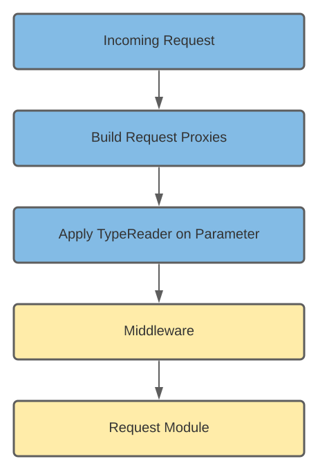

# TypeReader

This section will give you a general idea of how type readers work and how you can write your custom ones. 

## What are TypeReaders

What are **TypeReaders** even? Short answer. They are converters. They are used if you want your module parameter to not just be a simple string. Maybe you want it to be a **collection**, an **enum** or an **integer**. TwitchNET already has implemented a few _default_ converters. 

Value types that are supported:

- string
- int
- uint
- double
- long
- ulong
- byte
- sbyte

### How to utilize Type Readers

Maybe you ask yourself now, how do I use these converters now? Well to answer that question, I want you to explain you the lifecycle of an incoming request in TwitchNET.





The **blue** fields in the lifecycle are always called. The **yellow** ones is your custom input. In the section "Apply TypeReader on Parameter" all registered converters are getting pulled and the converter for the **Type** you used as an parameter in your module will convert the string.

### Register  TypeReader

Each [TwitchCommander]() has the option to register custom **Middleware** and custom **TypeReader** with the parameter **middlewareBuilder**.

 ```c#
 public async Task InitializeAsync()
 {
     
     //...
     
 	await commander.InitializeCommanderAsync(
 		serviceCollection: BuildServiceCollection(),
          typeof(Program).Assembly,
          middlewareBuilder: BuildRequestPipeline()
     );
 }	
 
 private static PipelineBuilder BuildRequestPipeline()
 	=> new PipelineBuilder()
     		.UseTypeReader<DummyTypeReader>();
 
 ```

The class [PipelineBuilder]("") has extension methodes to register your custom **TypeReader**.

